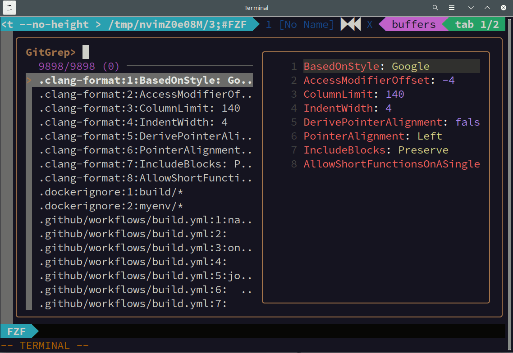

# jendeley v2 - インクリメンタルな曖昧検索の手法とその実装 <!-- omit in toc -->

[jendeley](https://zenn.dev/a_kawashiro/articles/a2170f967f9508)という JSON ベースの文書管理ソフトウェアを作って日々使っています。先日、バージョン 2 にアップデートするに当たって、長らく欲しかった文書全体に対するインクリメンタルな曖昧検索機能を実装しました。

## 目次 <!-- omit in toc -->

- [jendeley とは](#jendeley-とは)
- [インクリメンタルな曖昧検索](#インクリメンタルな曖昧検索)
  - [インクリメンタルな曖昧検索とは](#インクリメンタルな曖昧検索とは)
  - [jendeley のインクリメンタルな曖昧検索機能](#jendeley-のインクリメンタルな曖昧検索機能)
- [jendeley のインクリメンタルファジー検索の実装](#jendeley-のインクリメンタルファジー検索の実装)
  - [求められる性能](#求められる性能)
  - [ナイーブな実装](#ナイーブな実装)
  - [接尾辞木を用いた実装](#接尾辞木を用いた実装)
    - [接尾辞木とは](#接尾辞木とは)
    - [Ukkonen のアルゴリズムを用いた接尾辞木の構築](#ukkonen-のアルゴリズムを用いた接尾辞木の構築)
- [まとめ](#まとめ)
- [参考](#参考)
- [お願い](#お願い)
- [連絡先](#連絡先)

## jendeley とは

まずはじめに jendeley を簡単に紹介します。jendeley とは僕が作っている文書管理ソフトウェアです。`npm i @a_kawashiro/jendeley`でインストールできます。

- データベースを人間に可読な JSON で保持すること
- サーバではなくローカルの PC で動作すること
- node.js とブラウザが動く環境なら OS を問わず動作すること

の 3 つの原則のもとに開発しています。半年ほど前の 2022 年 11 月に開発を開始し、先日 v2.0 をリリースしました。2022 年 1 月にリリースした jendeley v1.0 はタイトル、著者、ユーザの付与したタグ、ユーザの書いたコメントに対してキーワードで文書を絞り込むことができました。しかし文書の中身に対して検索を行うことはできませんでした。

僕は昔から[検索エンジンを自作する](https://a-kawashiro.hatenablog.com/entry/2020/03/06/192527)ことに興味があることもあり、jendeley に全文検索を実装したいと思っていました。更に、常日頃から[fzf](https://github.com/junegunn/fzf)というファジー検索ツールを常用しているので、検索機能を実装するならインクリメンタルな曖昧検索を実装したいと考えていました。

## インクリメンタルな曖昧検索

### インクリメンタルな曖昧検索とは

「インクリメンタルな曖昧検索」とは、文字を一文字打つごとに新たに検索が行われ、また入力したキーワードに完全に一致しなくてもマッチするような検索のことです。[fzf](https://github.com/junegunn/fzf)は CLI で動作するインクリメンタルな曖昧検索ツールであり、シェルに組み込んで履歴の検索を行ったり、エディタ に組み込んでカレントディレクトリ以下のソースコードを検索することができます。



上の動画は[sold](https://github.com/akawashiro/sold)のソースコードを fzf を使って全文検索している様子です。曖昧検索なので完全に一致していない行もマッチしています。また、インクリメンタルな検索なので、一文字入力するごとに検索結果が更新されています。

このインクリメンタルな曖昧検索は非常に便利で、僕はファイル検索、キーワード検索、コマンドの履歴を検索するショートカットを登録し、利用しています。

### jendeley のインクリメンタルな曖昧検索機能

jendeley は v2.0.0 でインクリメンタルな曖昧検索を実装しました。登録した文書の本文、タイトル、著者全てに対してインクリメンタルな曖昧検索を行うことができます。下の動画は実際にインクリメンタルな曖昧検索を行っている様子です。"Type theory"という検索クエリで検索しており、1 文字打つごとに全文検索の結果が変わっています。また、マッチした部分を太文字で表示し、その周囲も表示します。このため、文書の中でその検索クエリがどのような文脈で使われているかが瞬時にわかります。


## jendeley のインクリメンタルファジー検索の実装

### 求められる性能

実装について説明する前に jendeley のインクリメンタルな曖昧検索に求められる性能を説明します。

まず、検索対象となる文字列のサイズです。現在、僕の jendeley のデータベースのサイズは 117MiByte あり、その大部分が登録した文書の本文です。よって、検索対象の文字列は少なく見積もっても 20 万文字程度あります。

```
$ ls -alh jendeley_db.json
-rw-r--r-- 1 akira akira 117M  5月 26 21:47 jendeley_db.json
```

次に応答時間です。今回は 100ms 以内に応答を返すことを目標に設定しました。

### ナイーブな実装

fzf で使われている検索アルゴリズムは[fzf のスコア計算を読んでみる](https://en-jp.wantedly.com/companies/wantedly/post_articles/306103)で解説されています。このアルゴリズムは動的計画法を使ってスコアを計算し、文書の長さ$n$、クエリの長さ$k$のとき$O(nk)$で動作します。

このアルゴリズムを実装し、実際に jendeley で使ってみたところ、応答に 1 秒以上かかることがありました。これではインクリメンタルな検索とは言い難いです。動的計画法のテーブルを部分的に構築するなどの工夫もしてみたのですが、一文字打つごとに$O(n)$の計算量がかかることが致命的で、小手先の改善ではインクリメンタルな検索は実現できないと判断しました。

### 接尾辞木を用いた実装

jendeley のインクリメンタルな曖昧検索には検索する対象の文字列が変化しない、という特徴があります。この特徴を活かして高速に文字列検索を実現するアルゴリズムに接尾辞木を用いた文字列検索があります。

#### 接尾辞木とは

[接尾辞木](https://ja.wikipedia.org/wiki/%E6%8E%A5%E5%B0%BE%E8%BE%9E%E6%9C%A8)とは与えられた文字列の接尾部を木構造で表すデータ構造です。例えば"BANANA"という文字列の接尾辞木は以下の図のようになります。一度、検索対象の文字列の接尾辞木を構築すれば、検索対象の文字列に対する検索は木の根からクエリに沿って木をたどっていくだけで実現でき、クエリの長さ$k$のとき$O(k)$で実装できます。

ただし、検索対象の文字列の長さが$n$のとき、接尾辞の数は$n$個、接尾辞の長さは$O(n)$です。このため、ナイーブに接尾辞木を構築した場合、$O(n^2)$の時間がかかります。これでは [求められる性能](#求められる性能)で述べた $n=2 \times 10^5$ のとき現実的な時間での構築が不可能です。


[https://ja.wikipedia.org/wiki/接尾辞木](https://ja.wikipedia.org/wiki/%E6%8E%A5%E5%B0%BE%E8%BE%9E%E6%9C%A8)より

#### Ukkonen のアルゴリズムを用いた接尾辞木の構築

ところが、接尾辞木を$O(n)$で構築するアルゴリズムが存在します。[Ukkonen のアルゴリズム](https://en.wikipedia.org/wiki/Ukkonen%27s_algorithm)です。詳細は省略しますが、Ukkonen のアルゴリズムを使えば接尾辞木を $O(n)$で構築することができます。jendeley での実装は [jendeley-backend/src/suffix_patricia_tree.ts](https://github.com/akawashiro/jendeley/blob/main/jendeley-backend/src/suffix_patricia_tree.ts)にあります。

実装に際しては以下の記事が大変参考になりました。特に 1 つ目の Stack Overflow の記事は構築の過程が丁寧に説明されており、アルゴリズムの挙動を把握する上で非常に役立ちました。

- [Ukkonen's suffix tree algorithm in plain English](https://stackoverflow.com/questions/9452701/ukkonens-suffix-tree-algorithm-in-plain-english)
- [Ukkonen’s Suffix Tree Construction – Part 1](https://www.geeksforgeeks.org/ukkonens-suffix-tree-construction-part-1/)
- [Ukkonen's algorithm - Wikipedia](https://en.wikipedia.org/wiki/Ukkonen%27s_algorithm)

## まとめ

jendeley では v2.0 のリリースにあたって、登録した全ての文書を対象とするインクリメンタルファジー検索を実装しました。この検索を高速に行うため、接尾辞木を Ukkonen のアルゴリズムを用いて構築しました。

## 参考

- [検索エンジンを自作する夢](https://a-kawashiro.hatenablog.com/entry/2020/03/06/192527)
  未踏プロジェクトで検索エンジンを作っていたときの反省文書です。
- [fzf](https://github.com/junegunn/fzf)
  日々使っている曖昧検索ツールです。
- [https://ja.wikipedia.org/wiki/接尾辞木](https://ja.wikipedia.org/wiki/%E6%8E%A5%E5%B0%BE%E8%BE%9E%E6%9C%A8)
- [Ukkonen's suffix tree algorithm in plain English](https://stackoverflow.com/questions/9452701/ukkonens-suffix-tree-algorithm-in-plain-english)
  Ukkonen のアルゴリズムの挙動を把握するときに役立つ記事です。
- [Ukkonen’s Suffix Tree Construction – Part 1](https://www.geeksforgeeks.org/ukkonens-suffix-tree-construction-part-1/)
  Ukkonen のアルゴリズムの実装に際しては Stack Overflow のものよりも役立つかもしれません。
- [Ukkonen's algorithm - Wikipedia](https://en.wikipedia.org/wiki/Ukkonen%27s_algorithm)
  Ukkonen のアルゴリズムの概略を把握するのに良いです。

## お願い

[Github の jendeley のリポジトリ](https://github.com/akawashiro/jendeley)にスターしてください。

## 連絡先

この記事に誤りがあった場合は[Twitter](https://twitter.com/a_kawashiro)等で連絡をください。修正します。その他の連絡先は [https://akawashiro.github.io/](https://akawashiro.github.io/#links) にあります。
